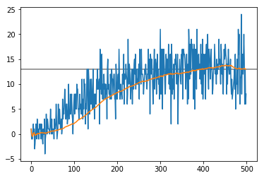

# P1 - Navigation
## Objective
Our objective in this project is to create an agent that can navigate a virtual environement full of yellow and blue bananas, and pick only the yellow ones.

## Approach
### Model
For this project, a simple DQN has been proposed as solution, the model is pretty simple:
```python
# state_size=37, actions_size=4, hidden_size=64
self.model = nn.Sequential(
	nn.Linear(state_size, hidden_size),
	nn.ELU(),
	nn.Linear(hidden_size, hidden_size),
	nn.ELU(),
	nn.Linear(hidden_size, actions_size),
)
```
It consist of 3 linear layers with an ELU activation between them, the input size is 37 and the output size is 4, the size of the hidden layers is 64.
### Agent
The model is trained within an agent, this agent contains 2 copies of the same model, one to use as target an the other one that will be updated using the optimizer.

In the `learn` method of the agent, we receive a batch consisting of states, actions, rewards, next_states and dones.  
We calculate, using the next_states, the target expected max action-state value using the target model (and a **gamma** of **0.99**), then we use it to calculate the loss, comparing it with the actual reward received. We backpropagate the loss, with a **learnin reate** of **0.002** into the model, then update the target model with a **tau** value of **0.002**.

### Replay Buffer
Nothing fancy, I just use a deque of size **1e5**, store all the touples when running the evironment, then when sampling I random sample a **batch size** of **128**.

### Learning procedure
I initialize the Agent, the ReplayBuffer, and define a total number of episodes of 500 (the model achieves the goal score before this).

I start with an **epsilon** value of 1 and decay it with a rate of **0.99** every episode, wich means that in the final episode the value will be around 0.0066, which means leas than 1% of probability of picking a random action.

For each episode, I do as many steps as necesary for the "done" value to be True, and in each step I:

- Use the agent to pick an action, based on the current state.
- Using the picked action, compute the next state and reward
- Add the state, action, reward, next state and done values in the ReplayBuffer
- Every 4 steps, use the "learn" method from the agent to update the inner model.


(When training, we see a speedup of what the agent is doing)


### Score and Results
The average score is calculated by averaging the score obtained in the last 100 episodes, that means that maybe the model did very well in some episodes, and not so good in other episode, but overall has a good performance.

We´re able to achieve the goal of 13.02 average score after 397 episodes, it then goes up to almost 14 but for some reason drops after around 480 episodes :/ 

Here´s a chart of the measured scores. In blue you can see the score in each episode, and in orange you see the averaged score (for the first 100 episodes the average is performed acrross the available episodes)



And here´s a gif of the trained model working its magic (it achieved a score of 17)


### Ideas for Future Work
I actually tried using Prioritized Experience Replay with very poor results, for once, updating the priority and sampling from a non uniform distribution reduced a lot the speed of the training, and the I didn't manage to geet good results, though I also couldn't experiment too much since it took very long to finish the 500 episodes.

I guess I could revisit an implementation of Prioritized Experience Replay in the future to see if I am able to achieve better results.

Other improvements could be to try both Double DQN and Dueling DQN, and/or combine all of the above into the rainbow DQN.

I've seen that some of my colleagues achieved an average score of 13 in less than 200 episodes (actually 300, but since we use the last 100 for evaluation, we cannot really start measuring until we have at least 100), so probably I can perform further tunning of my hyper-parameters to improve my results, though there's too much left to randomness so maybe I could even achive this with my setup by running the training enough times.


