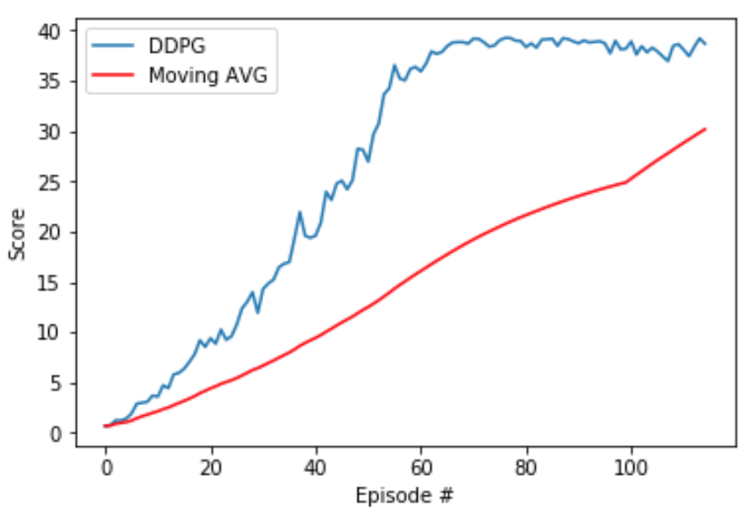

# P2 - Continuous Control

## Objective 
Our objective in this project is to create an agent that can control a double-jointed arm to follow a target.

## Approach

For this project I have used as a base the code from DDPG-pendulum available [here](/ddpg-pendulum) so many of the decisions, specially for hyper parameter choosing, have been based on making as few changes as possible to the original code in order for it to work in this new environment.

I have chosen to solve the 20 agents environment, though as I will explain later I did not actually use 20 different agents.

### Models

This models are defined in [model.py](model.py)

The agent contains 4 neural networks, 2 of which are actually identicall to the other 2.

**actor_local** and **actor_target** follow the same architecture, consisting on a MLP with 1 hidden layer of 400 nodes (the original model from the example code had 2 hidden layers, but I decided to simplify it a bit)

```python
self.fc1 = nn.Linear(state_size, fc1_units)
self.bn1 = nn.BatchNorm1d(fc1_units)
self.fc2 = nn.Linear(fc1_units, action_size)
self.reset_parameters()
...
x = F.relu(self.bn1(self.fc1(state)))
return F.tanh(self.fc2(x))
```

**critic_local** and **critic_target** are left exactly as presented in the example code, with 2 hidden layers of 400 and 300 nodes, the input is both the state and the action, but only the state is passed to the first layer, then the action is concatenated and the result is passed to the remaining layers.

```
self.seed = torch.manual_seed(seed)
self.fcs1 = nn.Linear(state_size, fcs1_units)
self.bn1 = nn.BatchNorm1d(fcs1_units)
self.fc2 = nn.Linear(fcs1_units+action_size, fc2_units)
self.fc3 = nn.Linear(fc2_units, 1)
self.reset_parameters()
...
xs = F.relu(self.bn1(self.fcs1(state)))
x = torch.cat((xs, action), dim=1)
x = F.relu(self.fc2(x))
return self.fc3(x)
```

### Agent
This is the most complex part of the code, and althoug it's based on the example code provided, a number of modifications have been introduced, so I will focus on them instead of explaining everything.

First of all, my model was not learning very well with the provided learning rates, so I changed them so both the actor and the critic have the same LR of 1e-3

Then the Agent has changes on the following functions:

- In **step()**: I added to the agent an extra parameter **num_agents**, since I chose the 20 agents environment, what I do there is add all the experiences from all the agents to a single replay buffer.

  After that, if the replay buffer has enough elements, I will perform the training, but as sugested in the project introduction I will only train every 20 steps, but then I will train for 10 batches sampled from the replay buffer.
  
- In **act()**: As the environment will give 20 different states for each agent, I will iterate through them and use the actor_local model to select an action.

  As was already done in the example, I will add noise to the action, but multiplied it with an epsilon value that will decrease over time, so at the beginning we encourage exploration but as the model improves we will exploit the adquired knowledge.
  
- In **learn()**: the only change here from the example code is the gradient clipping when training the critic

```
if GRAD_CLIPPING > 0:
  torch.nn.utils.clip_grad_norm_(self.critic_local.parameters(), GRAD_CLIPPING)
```

### Replay Buffer

The replay buffer is left unchanged from the example code, it will keep the last 1e6 experiences, then will sample minibatches of 128.

### Learning procedure 
AEven though I trained using the 20 agent environment, I do not actually create 20 independent agents. I use a single agent which accumulates the experience of all 20 agents, then updates a single copy of both the actor and the critic. This helps the agent to generalize better since it´s seeing much more different scenarios every episode, and also I am able to speed things up a little bit by paralelizing the training. 

We will train for a max of 1000 epsodes, or until we reach an average score using the last 100 scores of 30 (which luckily happens much sooner).

We could train for full episodes, but since we want the model to be able to generalize as much as possible we'll use only 1000 timesteps, then for each timestep we will select an action using `agent.act()` then perform a step in the environment and call `agent.step` with the resulting state and reward, this will in turn call the `leanrn()` method of the agent when required.

I keep track of the score from current episode by adding the rewards every timestep, then I will append them to a list, along with the average score amongst the last 100 episodes.

### Score and Results

The environment gets solved after 115 episodes, which means that, given that we need to average amongst the previos 100 episodes, we could say that the environment is solved in 15 episodes :D with an average score across the last 100 episodes of 30.2 and a max epsiodic score of 39.2.



And here's a gif of the trained agent doing its magic


## Ideas for Future Work

First of all, as I mentioned before, I did not actually train 20 independent agents, but a single agent getting 20 different experience sources, so a test that I might do is to use 20 actual different agents.

If I do that, I have the choice of keeping a shared replay buffer which will mean that I would be actually training 20 agents in the same way that I am training my single agent, or what would be more interesting is to try to keep them separate, then in the same fashion as the A2C or A3C, I could update a "master" agent every N episodes using the weights of all models, then reset all the target models to the master model to share knowledge across all the agents.

Also, of course, since I tried a DDPG approach, maybe just using A2C or A3C could give better results.

Finally, on the hyper-parameters level, I do believe that there could exist a set of hyper-parameters or model architectures that work better in this scenario, but training is slow and not super reliable (changing the random seed can change drastically how long it takes for the agent to learn) so it's not so easy to perform many experiments with my resources, so luckyly the baseline provided from the example code was good enough!  
