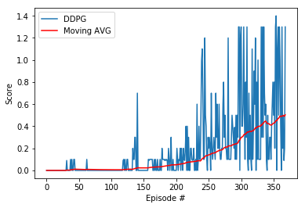
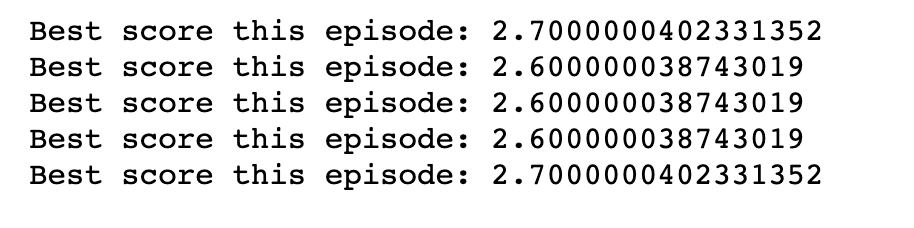

# P3 - Collaboration and Competition

## Objective 
The environement that we're going to solve in this exercice consists of a pair of agents playing tenis. The goal of each player is not to get more points than the other player, but to get the maximum score possible together, so it's a cooperative game where the goal is to keep the ball in game as long as posible.


## Approach

In order to solve this exercice I decided to use a very similar approach to the one used in the p2, but instead of re-using the code taken from the ddpg-pendulum environement I decided to reimplement it in order to fully learn how to do it.

As the game state contains information about the current agent and the score is shared I thought that a single agent would be enough to solve the game. It would gather experience for both players then sample randomly amongst them to learn.

For this project, instead of having separate files, I put everything in the **Tennis.ipynb** file in order to be able to experiment more quickly.

### Models

The agent contains 4 neural networks, 2 of which are actually identicall to the other 2.

**actor_local** and **actor_target** follow the same architecture, consisting on a MLP with 24 input nodes, 2 hidden layer of 512 and 256 nodes and the output layer has 2 nodes and tanh, since the action space is just 2 values between -1 and 1.


```python
def __init__(self, hidden_size=512):
   ...
	self.actor = nn.Sequential(
	    nn.BatchNorm1d(24),
	    nn.Linear(24, hidden_size),
	    nn.BatchNorm1d(hidden_size),
	    nn.ReLU(),
	    nn.Linear(hidden_size, hidden_size//2),
	    nn.BatchNorm1d(hidden_size//2),
	    nn.ReLU(),
	    nn.Linear(hidden_size//2, 2),
	    nn.Tanh()
	)
```

**critic_local** and **critic_target** are slightly different, they also have 2 hidden layers, but the first one only receives as an input the state, and the second one gets the state and the actions generated by the actor. The hiddel layers have both 512 nodes and the output is 1 value, which will be used as a measure of the max expected score for that action in that state.

```python
def __init__(self, hidden_size=512):
	...
	self.first_layer = nn.Sequential(
        nn.BatchNorm1d(24),
        nn.Linear(24, hidden_size),
        nn.BatchNorm1d(hidden_size),
        nn.ReLU(),
    )

    self.critic = nn.Sequential(
        nn.Linear(hidden_size+2, hidden_size),
        nn.BatchNorm1d(hidden_size),
        nn.ReLU(),
        nn.Linear(hidden_size, 1)
    )
```

### Agent
The agent used in this exercice is the same used in the previous one, with a few modifications: 

- First of all, I use only 2 agents, so the model is changed from 20 to 2, since in the last exercice I used the 20 agents environement.

- I increased the batch size to 256, and train the model 3 times for every step, with different samples. 

- When soft-updating the model, I use 0.002 instead of 0.001 to speed up a little bit the training, since in this scenario at least it´s very hard for the model to achieve good results by taking actions randomly, so the faster the target moves towards the local, the better (of course, without being too fast or it will introduce too high variance).

- I also set the OUNoise sigma to a very low value, to reduce noise, will not removing it, since as mentioned before, in this environement taking actions too randomly rarely yields good results.

### Replay Buffer

I used a simpler version of the ReplayBuffer used in p2, though it works exactly the same with a couple of changes:

- I changed the batch-size to 256 as mentioned above.
- I reduced the buffer_size to 100000, so 10 times less than before, since I noticed that games are usually not very long, and keeping too many experiences of failed attempts was slowing down the model. The logic behind reducint the buffer size is that whenever the model learns a good strategy, because the buffer is smaller it will be sampled more often when training, leading to a better learning, that will in turn lead to gathering better experiences, that will be sampled more often etc, so once the model is in the right path, the learning is not slowed down by re-living "bad experiences".

I didn't use prioritized experience replay in this exercice either, but it's definitely a future improvement, since I really saw a big improvement when reducing the buffer size leading to more meaningful experiences being sampled.

### Learning procedure 
The training procedure is basically identicall to the one in project 2: The agent will choose an action for each player based on their states, then will gather the experiences from both players and will update itself.

I set a maximum of 3000 episodes, since in my initial experiments it was taking a really long time to learn, but luckily the environement was solved way faster at the end, anfter the changes I made.

The only changes to the training procedure is the number of max timesteps per episode, that I set to 500 instead of 1000. I noticed that will 500 steps I could reach a maximum score of 1.4 if the game was almost perfect, so that should be more than enough to achieve an average of 0.5. I tried with a higher number of steps, and the max score can be higher thus leading to an average of 0.5 faster, but the episodes can also take way longer to finish if the agents are playing a perfect match, so I had to find a balance.


### Score and Results

The environment gets solved after 369 episodes, which means that, given that we need to average amongst the previos 100 episodes, we could say that the environment is solved in 269 episodes :D with an average score across the last 100 episodes of 0.5036 and a max epsiodic score of 1.4



And if I run the agent in an environement without the 500 steps limit for 5 episodes, I am able to pretty consistently get a score of above 2.6 




## Ideas for Future Work

The solution that I propose is pretty simple, and I didn't really had to do any change to adapt it to a competitive or cooperative scenario, so my first approach for improving the results would be to try to use MADDPG or similar.

As I mentioned before, I would also think that by using prioritized experience replay I could achieve much better results much faster, because in this scenario it's important that when the agent has found a strategy that works, it sticks somehow to it, and tries to explore similar strategies that also work but are not completely random since pure randomness gives bad results.

Finally, even thoug the score computed is the max between the scores of the two agents, and we can think of this problem as a cooperative problem, it would be very interesting to train two agents to solve this scenario in a competitive way. I would expect to still have good results, as both agents want to win so they will keeo improving until one of them reaches a max average score of 0.5, but I expect the results of the training to be much different, for example having a much more agresive way of playing, and trying much more wild cases instead of sticking to a fairly simple gameplay where they just try not to drop the ball.

